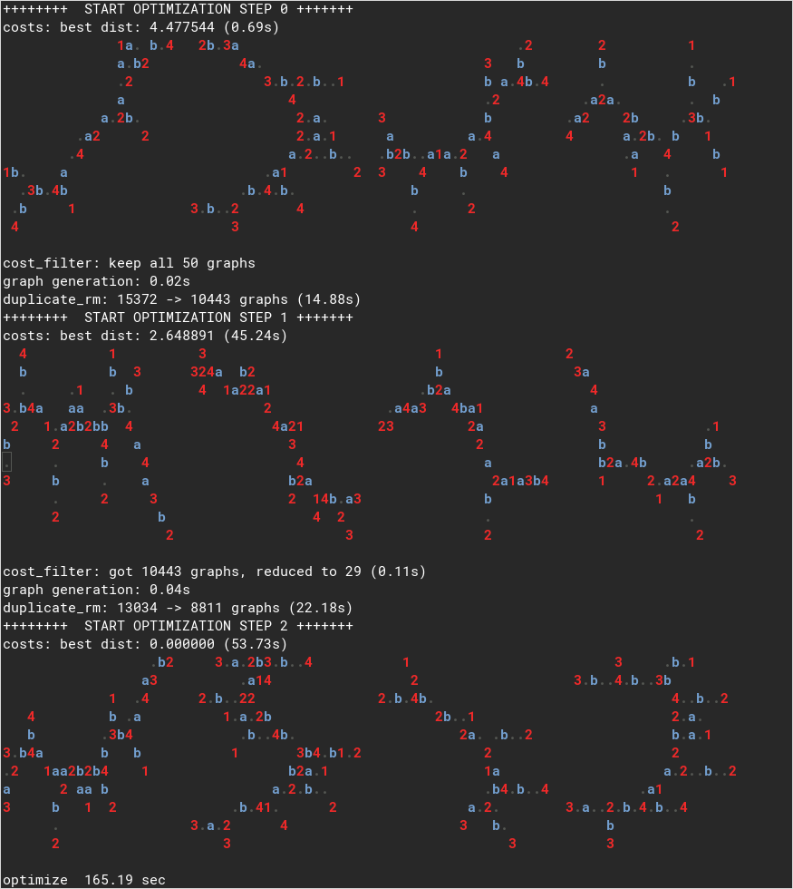

# Installation

this should cover most of the depencencies 
``` 
pip install structout graphlearn 
pip install git+https://github.com/fabriziocosta/EDeN.git --user
```


# Usage 


1.  generate a set of random graphs by editing params_graphs in reconstruct.py and running:

```
python3 reconstruct.py maketasks
# you can inspect the set via
# python3 inspecttasks.py .tasks
# util/rule_rand_graphs.py contains even more options for graph generation
```

2. run the experiments.

Edit params_insta and params_opt to anjust parameters of the instance maker and the optimizer.
Then calculate the number of reconstructions that need to be performed. Here we set the number to 1000 because 
we conduct 50 reconstructions and explore 5 x 4 parameter combinations of the instance maker (see below).
During the reconstruction a lot of debug information is displayed.
```
seq 0 1000 | parallel  -j 10 python3 reconstruct.py
```

3. look at reports 

edit the report function and look at the result. You see (#success, #iterations used by the 'slowest' attempt)
```
python3 reconstruct.py report 
           marks:10  marks:20  marks:25  marks:30   marks:5
neigh:100   (35, 9)  (36, 18)  (37, 12)  (33, 15)  (29, 17)
neigh:150  (35, 16)  (34, 13)  (37, 12)  (37, 16)  (30, 19)
neigh:25   (31, 12)  (32, 17)  (32, 17)  (33, 19)  (25, 18)
neigh:50    (31, 8)  (38, 19)  (36, 15)  (36, 15)  (29, 18)
```


# chemical datasets

use maketaskschem and reportchem respectively :)  


# sample output



